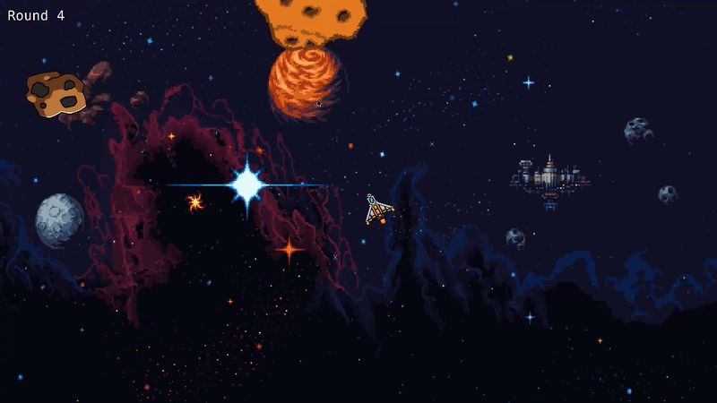

## raumkūkan

A simple game inspired by the classic arcade game "Asteroids"

The game is quite barebones, I may return in the future to add more features.

## Building

Requires C++17, SDL2_image, SDL2_mixer, SDL2_ttf, @development-tools for toolchains, build essentials, libaries, debugging etc.

On Fedora:

```bash

# Build tools and dependencies
sudo dnf install @development-tools SDL2-devel libomp SDL2_image-devel SDL2_mixer-devel SDL2_ttf-devel

# Build 
make run

```


