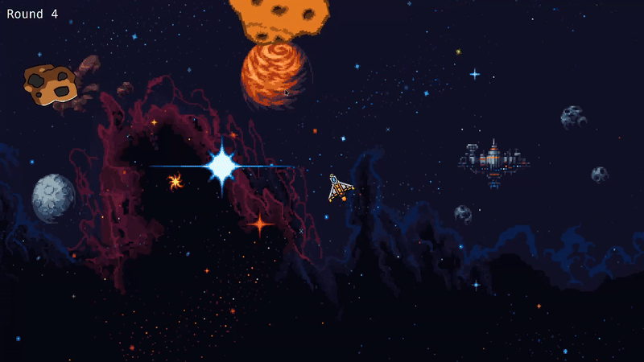

## raumkūkan

A simple game inspired by the classic arcade game "Asteroids"

The game is quite barebones, I may return in the future to add more features.

## Building

Requires C++17, SDL2_image, SDL2_mixer, SDL2_ttf, @development-tools for toolchains, build essentials, libaries, debugging etc.

On Fedora:

```bash

# Build tools and dependencies
sudo dnf install @development-tools SDL2-devel libomp SDL2_image-devel SDL2_mixer-devel SDL2_ttf-devel

# Build 
make run

```



## Assets used

https://wallpapers.com/png/cartoon-asteroid-illustration-61zv73sqlxixk2kw.html

https://wallpapers.com/png/cartoon-asteroid-illustration-61zv73sqlxixk2kw.html

https://www.moddb.com/games/starmancer/images/skybox

https://www.megavoxels.com/learn/how-to-make-a-pixel-art-spaceship/

https://www.pixilart.com/art/blue-laser-bullet-4fdcaf91e0b9e2a

https://www.youtube.com/watch?v=9--lKyEphWY&list=RD9--lKyEphWY&start_radio=1

https://pixabay.com/sound-effects/film-special-effects-laser-312360/
